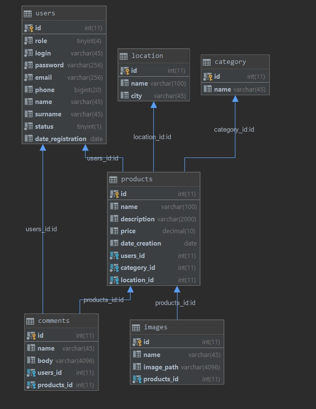

Final Task. Web Project
===========================
- Приложение реализовать применяя технологии Servlet и JSP.
- Архитектура приложения должна соответствовать шаблонам Layered architecture и MVC. Controller может быть только двух видов: контроллер роли или контроллер приложения.

Требования
----------
- Информация о предметной области должна хранится в БД:
- Если данные в базе хранятся на кириллице, рекомендуется применять кодировку utf-8
- Технология доступа к БД только JDBC
- Для работы с БД в приложении должен быть реализован потокобезопасный пул соединений, использовать synchronized и volatile запрещено.
- При проектировании БД рекомендуется использовать не более 6-8 таблиц
- Работу с данными в приложении осуществлять посредством шаблонов DAO или Specification.
- Реализовать защиту от sql injection.

Базовые требования к приложению
-----------------------
- Интерфейс приложения должен быть локализован; выбор из языков: EN|BE|DE etc.
- Приложение должно корректно обрабатывать возникающие исключительные ситуации, в том числе вести их логи. В качестве логгера использовать Log4J2/SLF4J.
- Классы и другие сущности приложения должны быть грамотно структурированы по пакетам и иметь отражающую их функциональность название.
- При реализации бизнес-логики приложения следует при необходимости использовать шаблоны проектирования (например, шаблоны GoF: Factory Method, Command, Builder, Strategy, State, Observer, Singleton, Proxy etc).
- Для хранения пользовательской информации между запросами использовать сессию.
- Для перехвата и корректировки объектов запроса (request) и ответа (response) применить фильтры.
- Разрешается использовать технологии AspectJ и Web-services.
- При реализации страниц JSP следует использовать теги библиотеки JSTL
- Использовать скриплеты запрещено.
- При реализации пользовательского интерфейса разрешается использовать любые технологии front-end разработки (js, AJAX).
- Реализовать защиту от cross site scripting (xss)
- Реализовать защиту от повторного выполнения запроса нажатием F5.
- Реализовать собственные теги.
- Просмотр “длинных списков” желательно организовывать в постраничном режиме.
- Валидацию входных данных производить на клиенте и на сервере.
- Документацию к проекту необходимо оформить согласно требованиям javadoc.
- Оформление кода должно соответствовать Java Code Convention.
- При развертывании приложения разрешается использовать технологию Maven.
- Приложение должно содержать тесты TestNG, JUnit, Mockito или EasyMock.
- Приложение должно быть размещено на Bitbucket.com

Минимальные требования к функциональности приложения
-------------------------------
- Авторизация (sign in) и выход (sign out) в/из системы.
- Регистрация пользователя и/или добавление артефакта предметной области системы.
- Просмотр информации (например: просмотр всех ставок тотализатора, статистики заказов, счетов и т.д.)
- Удаление информации (например: отмена заказа, удаление сущности и т.д.)
- Добавление и модификация информации (например: создать и отредактировать товар, создать и отредактировать заказ и т.д.)

Предметная область
===================

Торговая площадка  **Kefir**. Предназначена для размещения различных товаров с целью продажи или приобретения подходящего Вам товара.
- [ ] **Гость** может просматривать список существующих торговых позиций, просматривать выбранную, зарегистрироваться или авторизоваться в системе.
- [ ] Роль **Пользователя** включает в себя возможности роли **Гостя**, а также возможности создания, изменения и удаления собственных торговых позиций, создания комментария к торговой позиции, изменения данных собственного профиля.
- [ ] Роль **Администратора** включает все возможности **Пользователя**, а также позволяет просматривать список всех **Пользователей** сайта, изменять и удалять выбранные товарные позиции, блокировать или разблокировать **Пользователей**.

kefir data base diagram:

